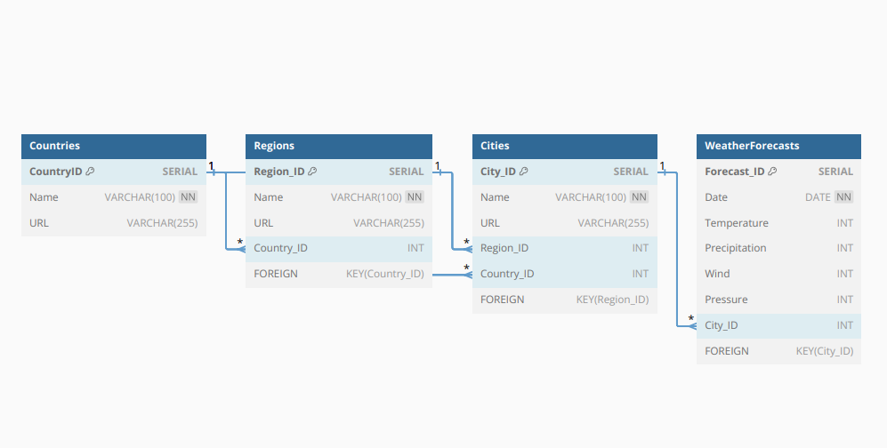

# Сбор данных о погоде по всему миру, используя сайт Гидрометцентр России (meteoinfo.ru)

# Цель проекта
Собрать данные о погоде из всех стран мира, их регионов, если таковые существуют, а также городов для дальнейшего использования в своих целях, в различных приложениях или для анализа данных. Также, в цели проекта входит предложение о способе хранения данных (то есть, модель данных)

# Собранные данные
В сбор данных входят такие данные как:
- Страны
- Регионы, которые находятся в этой стране (если есть)
- Города
- Дата
- Дневное/ночное измерение погодных условий в конкретном городе
- Температура масимальная в конкретном городе
- Осадки, их вероятность в конкретном городе
- Ветер, м/с в конкретном городе
- Давление, мм. рт.ст в конкретном городе

# Как программа вернёт данные
по окончании сбора данных программа вернёт данные в JSON формате.
Пример:
```
{
  'mainPage': 'https://meteoinfo.ru/forecasts/',
  'countries': {
    'russia': {
      'name': 'Россия',
      'url': 'https://meteoinfo.ru/forecasts/russia'
      'response': '<Response [200]>',
      'has_regions': True
      }
    },
  'regions': {
      'republic-bashkortostan': {
        'name': 'Башкорстостан',
        'url': 'https://meteoinfo.ru/forecasts/russia/republic-bashkortostan',
        'response': '<Response [200]>',
        'has_regions': True,
        'country': {
            'name': 'russia',
            'url': 'https://meteoinfo.ru/forecasts/russia',
          },
      },
    },
  'cities': {
      'Ufa': {
          'name': 'уфа',
          'url': 'https://meteoinfo.ru/forecasts/russia/republic-bashkortostan/Ufa',
          'response': '<Response [200]>',
          'has_regions': True,
          'region': {
              'name': 'republic-bashkortostan',
              'url': 'https://meteoinfo.ru/forecasts/russia/republic-bashkortostan',
          },
          'country': {
            'name': 'russia',
            'url': 'https://meteoinfo.ru/forecasts/russia',
          },
          'information': {
              '14 сентября': {
                  'temperature': 29,
                  'precipitation': 95,
                  'wind': 2,
                  'pressure': 761
                },
              '15 сентября': {
                  'temperature': 29,
                  'precipitation': 95,
                  'wind': 2,
                  'pressure': 761
                },
          }
      },
    },
}
```

# Модель данных, предлагаемая для этого проекта
При выборе модели данных, существует 2 варианта подходящих под данную задачу, **Relation** и **Star** модели. Однако, модель данных **Star** подходит меньше, поскольку она предпочтительна в аналитических целях, а также когда идет обработка данных за длительный период времени, а также у нас данные будут часто обновляться, поэтому модель **Star** не подойдет и мы отдаем предпочтение модели **Relation**

## Предлагаемая структура реляционной базы данных
Предлагаемая структура реляционной базы данных:
```
Таблица "Страны" (Countries):
ID (Primary Key)
Name (Название страны)
URL (Ссылка на страницу страны)

Таблица "Регионы" (Regions):
ID (Primary Key)
Name (Название региона)
URL (Ссылка на страницу региона)
Country_ID (Foreign Key) — связь с таблицей "Страны"

Таблица "Города" (Cities):
ID (Primary Key)
Name (Название города)
URL (Ссылка на страницу города)
Region_ID (Foreign Key) — связь с таблицей "Регионы"
Country_ID (Foreign Key) — связь с таблицей "Страны" (напрямую или через регионы)

Таблица "Прогнозы погоды" (Weather Forecasts):
ID (Primary Key)
Date (Дата прогноза)
Temperature (Температура)
Precipitation (Осадки)
Wind (Скорость ветра)
Pressure (Давление)
City_ID (Foreign Key) — связь с таблицей "Города"
```
### Визуализация такой модели
****

# Рекомендации для расширения проекта
Есть несколько моментов, которые молжно улучшить в данном проекте:
- Расширить скрипт по сбору данных с сайта, чтобы проверять какие данные в каких годорах изменились и перезаписать их в реляционной базе данных
- Чтобы не парсить каждый раз одни и те же данные, как при первом запуске скрипта, и избежать дублирования данных в таблице, добавить проверку на существование заполненных таблиц и данных в них
- Ежедневно дозаполнять данные в таблице

